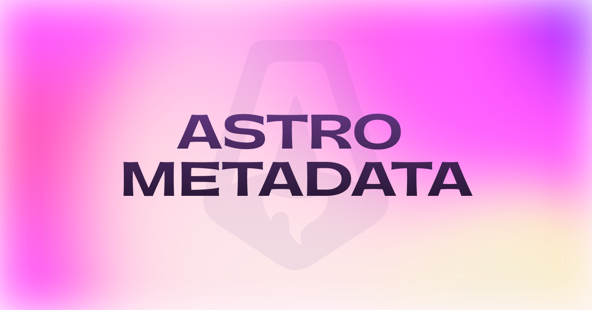

# Astro Metadata




Astro components for managing your page head — metadata, social sharing, favicons, and SEO.

---

## Table of contents

- [Installation](#installation)
- [Patterns](#patterns)
  - [1. Head component](#1-head-component)
  - [2. Individual components](#2-individual-components)
  - [3. Metadata utility](#3-metadata-utility)
- [Components](#components)
  - [Canonical](#canonical)
  - [Description](#description)
  - [Favicon](#favicon)
  - [Head](#head)
  - [Keywords](#keywords)
  - [LanguageAlternates](#languagealternates)
  - [OpenGraph](#opengraph)
  - [Robots](#robots)
  - [Schema](#schema)
  - [Title](#title)
  - [Twitter](#twitter)
- [License](#license)

---

## Installation
```bash
pnpm add @mannisto/astro-metadata
```

---

## Patterns

There are three ways to use this package. Pick what suits your project, or combine them freely.

### 1. Head component

The simplest approach. Use `Head` in your layout and pass props down from your pages. Charset and viewport are included automatically.
```astro
---
// layouts/Layout.astro
import { Head } from "@mannisto/astro-metadata"
import type { HeadProps } from "@mannisto/astro-metadata"

interface Props extends HeadProps {}

const { title, description, ...rest } = Astro.props
---

<html>
  <Head
    title={title}
    description={description}
    titleTemplate="%s | My Site"
    {...rest}
  />
  <body>
    <slot />
  </body>
</html>
```
```astro
---
// pages/index.astro
import Layout from "../layouts/Layout.astro"
---

<Layout title="Home" description="Welcome to my site">
  <h1>Hello</h1>
</Layout>
```

Best for simple sites where pages pass metadata as props to their layout.

---

### 2. Individual components

Use components directly inside your own `<head>`. Useful when you only need specific pieces, or want full control over the structure.
```astro
---
import { Title, Description, OpenGraph, Favicon } from "@mannisto/astro-metadata"
---

<html>
  <head>
    <meta charset="UTF-8" />
    <meta name="viewport" content="width=device-width, initial-scale=1.0" />
    <Title value="My Page" template="%s | My Site" />
    <Description value="Welcome to my site" />
    <OpenGraph
      title="My Page"
      description="Welcome to my site"
      image={{ url: "/og.jpg", alt: "My Site", width: 1200, height: 630 }}
    />
    <Favicon
      icons={{
        default: {
          ico: { path: "/favicon.ico" },
          svg: { path: "/favicon.svg" },
        }
      }}
    />
  </head>
  <body>
    <slot />
  </body>
</html>
```

Best for when you want to compose only what you need, or when `Head` is too opinionated for your setup.

---

### 3. Metadata utility

Set metadata in your page, resolve it in your layout. Eliminates prop drilling through nested layout layers.
```astro
---
// pages/about.astro
import { Metadata } from "@mannisto/astro-metadata"
import Layout from "../layouts/Layout.astro"

Metadata.set({
  title: "About",
  description: "Learn more about us",
  openGraph: {
    image: { url: "/og/about.jpg", alt: "About" }
  }
})
---

<Layout>
  <h1>About</h1>
</Layout>
```
```astro
---
// layouts/Layout.astro
import { Head, Metadata } from "@mannisto/astro-metadata"

const meta = Metadata.resolve({
  title: "My Site",
  description: "Default description",
  titleTemplate: "%s | My Site",
})
---

<html>
  <Head {...meta} />
  <body>
    <slot />
  </body>
</html>
```

`Metadata.resolve()` merges page values over your layout defaults — whatever the page sets wins, everything else falls back gracefully.

Best for sites with deeply nested layouts, or when you want to keep metadata co-located with page content.

---

## Components

### Canonical

Renders a canonical link tag. Falls back to `Astro.url.href` when no value is provided, so every page gets a canonical tag with zero configuration.
```astro
<Canonical value="https://example.com/page" />
```

| Prop | Type | Description |
|------|------|-------------|
| `value` | `string` | Canonical URL. Defaults to `Astro.url.href`. |

---

### Description
```astro
<Description value="Welcome to my site" />
```

| Prop | Type | Description |
|------|------|-------------|
| `value` | `string` | Page description |

---

### Favicon

Favicon support with dark and light mode variants, multiple formats, and optional cache busting.
```astro
<Favicon
  icons={{
    default: {
      ico:   { path: "/favicon.ico" },
      svg:   { path: "/favicon.svg" },
      png:   [{ path: "/favicon-96x96.png", size: 96 }],
      apple: { path: "/apple-touch-icon.png", size: 180 },
    },
    lightMode: {
      svg: { path: "/favicon-light.svg" },
    },
    darkMode: {
      svg: { path: "/favicon-dark.svg" },
    },
  }}
  manifest="/site.webmanifest"
  cacheBust
/>
```

| Prop | Type | Description |
|------|------|-------------|
| `icons.default` | `FaviconIcons` | Default favicon set |
| `icons.lightMode` | `FaviconIcons` | Favicons shown in light color scheme |
| `icons.darkMode` | `FaviconIcons` | Favicons shown in dark color scheme |
| `manifest` | `string` | Path to web app manifest |
| `cacheBust` | `boolean` | Append `?v={timestamp}` to favicon URLs |

#### FaviconIcons

| Prop | Type | Description |
|------|------|-------------|
| `ico` | `FaviconFile` | `.ico` favicon |
| `svg` | `FaviconFile` | `.svg` favicon |
| `png` | `FaviconFile \| FaviconFile[]` | One or more `.png` favicons |
| `apple` | `FaviconFile` | Apple touch icon |

#### FaviconFile

| Prop | Type | Description |
|------|------|-------------|
| `path` | `string` | Path to the file |
| `size` | `number` | Size in pixels. Rendered as `NxN` in the `sizes` attribute. |

---

### Head

Wraps the entire page head and composes all sub-components internally. Charset and viewport are always included.
```astro
<Head
  title="Home"
  titleTemplate="%s | My Site"
  description="Welcome to my site"
  openGraph={{ image: { url: "/og.jpg", alt: "My Site", width: 1200, height: 630 } }}
  favicon={{ icons: { default: { ico: { path: "/favicon.ico" } } } }}
/>
```

| Prop | Type | Description |
|------|------|-------------|
| `title` | `string` | Page title. Required. |
| `titleTemplate` | `` `${string}%s${string}` `` | Title template. Must contain `%s`, e.g. `"%s \| My Site"` |
| `description` | `string` | Page description |
| `canonical` | `string` | Canonical URL. Defaults to `Astro.url.href` |
| `keywords` | `string[]` | List of keywords |
| `robots` | `RobotsProps` | Robots directives |
| `openGraph` | `OpenGraphProps` | Open Graph tags |
| `twitter` | `TwitterProps` | Twitter card tags |
| `favicon` | `FaviconProps` | Favicon configuration |
| `schema` | `SchemaProps` | JSON-LD structured data |
| `languageAlternates` | `LanguageAlternate[]` | Hreflang alternate links |

#### Slots
```astro
<Head title="My Site">
  <!-- Renders before charset and viewport -->
  <meta slot="top" http-equiv="X-UA-Compatible" content="IE=edge" />

  <!-- Renders at the end of <head> -->
  <script src={analyticsUrl} />
</Head>
```

---

### Keywords
```astro
<Keywords value={["astro", "seo", "metadata"]} />
```

| Prop | Type | Description |
|------|------|-------------|
| `value` | `string[]` | List of keywords |

---

### LanguageAlternates

Renders `<link rel="alternate" hreflang>` tags for multilingual sites. Tells search engines which language version to serve for a given region.
```astro
<LanguageAlternates
  alternates={[
    { href: "https://example.com/en",  hreflang: "en" },
    { href: "https://example.com/fi",  hreflang: "fi" },
    { href: "https://example.com",     hreflang: "x-default" },
  ]}
/>
```

| Prop | Type | Description |
|------|------|-------------|
| `alternates` | `LanguageAlternate[]` | List of alternate language pages |
| `alternates[].href` | `string` | Full URL of the alternate page |
| `alternates[].hreflang` | `string` | Language or region code, e.g. `en`, `fi`, `en-US`, `x-default` |

---

### OpenGraph

Renders Open Graph meta tags for rich previews when your pages are shared on social platforms. When used inside `Head`, `title`, `description` and `url` fall back to the page values automatically.
```astro
<OpenGraph
  title="My Page"
  description="Welcome to my site"
  image={{ url: "/og.jpg", alt: "My Site", width: 1200, height: 630 }}
  url="https://example.com"
  siteName="My Site"
  locale="en_US"
/>
```

| Prop | Type | Default | Description |
|------|------|---------|-------------|
| `title` | `string` | — | OG title |
| `description` | `string` | — | OG description |
| `image.url` | `string` | — | Image URL. Required if image is set. |
| `image.alt` | `string` | — | Image alt text |
| `image.width` | `number` | — | Image width in pixels. Recommended: `1200` |
| `image.height` | `number` | — | Image height in pixels. Recommended: `630` |
| `url` | `string` | — | Canonical URL for the OG object |
| `type` | `string` | `"website"` | OG type |
| `siteName` | `string` | — | Name of the site |
| `locale` | `string` | — | Locale, e.g. `en_US` |

---

### Robots

Controls how search engines crawl and index your page. Defaults to `index, follow`.
```astro
<Robots
  noArchive
  extra="max-snippet:-1, max-image-preview:large, max-video-preview:-1"
/>
```

| Prop | Type | Default | Description |
|------|------|---------|-------------|
| `index` | `boolean` | `true` | Allow indexing |
| `follow` | `boolean` | `true` | Allow following links |
| `noArchive` | `boolean` | — | Prevent search engines from caching the page |
| `noSnippet` | `boolean` | — | Prevent text snippets in search results |
| `extra` | `string` | — | Additional directives, e.g. `"max-snippet:-1, max-image-preview:large"` |

---

### Schema

Outputs a `<script type="application/ld+json">` tag for structured data. Use it to help search engines understand your content and qualify for rich results.
```astro
<Schema
  schema={{
    "@context": "https://schema.org",
    "@type": "Person",
    "name": "Ere Männistö",
    "url": "https://example.com",
  }}
/>
```

| Prop | Type | Description |
|------|------|-------------|
| `schema` | `Record<string, unknown>` | JSON-LD object |

---

### Title

Renders the `<title>` tag. The template must contain `%s`, which is replaced with the page title — TypeScript enforces this at the type level.
```astro
<Title value="My Page" template="%s | My Site" />
<!-- <title>My Page | My Site</title> -->
```

| Prop | Type | Description |
|------|------|-------------|
| `value` | `string` | Page title. Required. |
| `template` | `` `${string}%s${string}` `` | Template string. Must contain `%s`. |

---

### Twitter

Renders Twitter card meta tags for rich previews on X. When used inside `Head`, `title` and `description` fall back to the page values automatically.
```astro
<Twitter
  card="summary_large_image"
  site="@mysite"
  creator="@myhandle"
  image={{ url: "/og.jpg", alt: "My Site" }}
/>
```

| Prop | Type | Default | Description |
|------|------|---------|-------------|
| `title` | `string` | — | Card title |
| `description` | `string` | — | Card description |
| `image.url` | `string` | — | Image URL. Required if image is set. |
| `image.alt` | `string` | — | Image alt text |
| `card` | `"summary" \| "summary_large_image"` | `"summary_large_image"` | Card type |
| `site` | `string` | — | Twitter handle of the site, e.g. `@mysite` |
| `creator` | `string` | — | Twitter handle of the content author |

---

## License

MIT