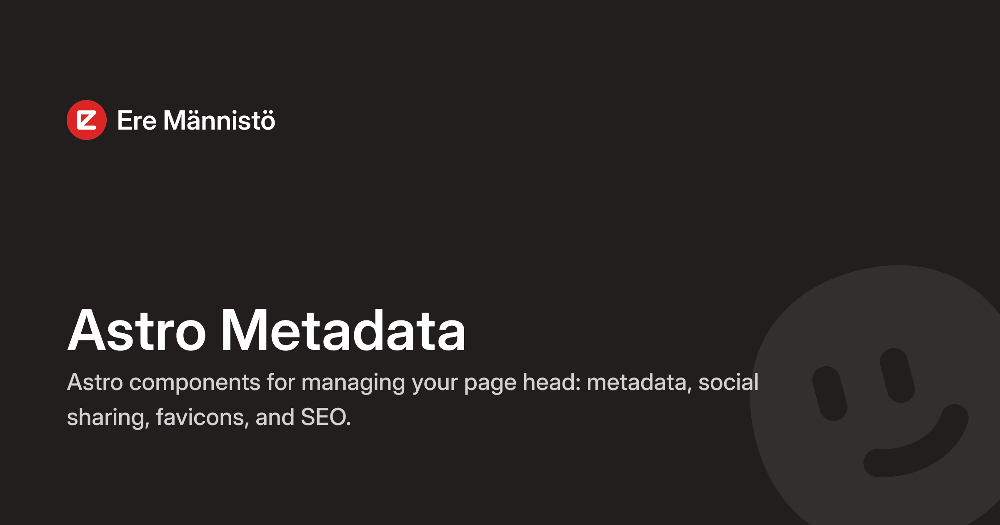

# Astro Metadata




Astro components for the page head: metadata, social cards, favicons, the web app manifest and structured data.

- **Components:** `Head` renders the full head. The smaller components render one part each.
- **Site-wide defaults:** Put the site name, the title template and other defaults in `src/metadata.config.ts`. Each text can have one value for each locale.
- **Favicons:** Give one source image. The integration generates all favicon files.
- **Web app manifest:** Put the manifest in the config file. The integration serves one manifest for each locale.
- **Structured data:** Typed JSON-LD builders fill in values from the config.
- **Absolute URLs:** The canonical URL, the social images and the alternate links use the Astro `site` and `base`.
- **Checks:** A dev toolbar app shows the metadata, the social card previews and the problems of the current page. The build logs the same problems.

Each feature is optional. The components work without the integration and without a config file.

## Installation

```bash
# pnpm
pnpm add @mannisto/astro-metadata

# npm
npm install @mannisto/astro-metadata

# yarn
yarn add @mannisto/astro-metadata
```

## Quick start

Use `Head` in your layout, and give it the values of the page:

```astro
---
// src/layouts/Layout.astro
import { Head, type HeadProps } from "@mannisto/astro-metadata"

type Props = HeadProps
---

<html lang="en">
  <Head {...Astro.props} />
  <body>
    <slot />
  </body>
</html>
```

```astro
---
// src/pages/index.astro
import Layout from "../layouts/Layout.astro"
---

<Layout title="Home" description="Welcome to my site">
  <h1>Hello</h1>
</Layout>
```

Set `site` in `astro.config.mjs`. The canonical URL and the social images must be absolute URLs, and the package uses `site` to make them.

[Read more about `Head` →](docs/usage/head.md)

## Site-wide defaults

Add the integration to `astro.config.mjs`:

```js
import metadata from "@mannisto/astro-metadata/integration"
import { defineConfig } from "astro/config"

export default defineConfig({
  site: "https://example.com",
  integrations: [metadata()],
})
```

Then add `src/metadata.config.ts`. The props of `Head` override these values:

```ts
import { defineMetadata } from "@mannisto/astro-metadata"

export default defineMetadata({
  siteName: "My Site",
  titleTemplate: "%s | My Site",
  description: "The default description",
  image: { url: "/og.jpg", width: 1200, height: 630 },
  twitter: { site: "@mysite" },
})
```

[Read more about the config file →](docs/usage/config.md)

## Favicons

Give the integration one square source image. An SVG gives the best result:

```js
metadata({
  favicon: {
    source: "./src/assets/logo.svg",
  },
})
```

`Head` then renders the favicon tags automatically.

[Read more about favicons →](docs/usage/favicons.md)

## Documentation

**Usage**

- [Head](docs/usage/head.md)
- [Config file and integration](docs/usage/config.md)
- [Favicons](docs/usage/favicons.md)
- [Web app manifest](docs/usage/manifest.md)
- [Checks and the dev toolbar app](docs/usage/checks.md)
- [Individual components](docs/usage/components.md)
- [Migration from 1.x](docs/usage/migration.md)

**Components**

- [Alternates](docs/components/alternates.md)
- [Canonical](docs/components/canonical.md)
- [Description](docs/components/description.md)
- [Head](docs/components/head.md)
- [Icons](docs/components/icons.md)
- [OpenGraph](docs/components/open-graph.md)
- [Robots](docs/components/robots.md)
- [Schema](docs/components/schema.md)
- [Title](docs/components/title.md)
- [Twitter](docs/components/twitter.md)

## Contributing

See [CONTRIBUTING.md](CONTRIBUTING.md) for the setup and the guidelines.

## License

MIT © [Ere Männistö](https://github.com/eremannisto)
